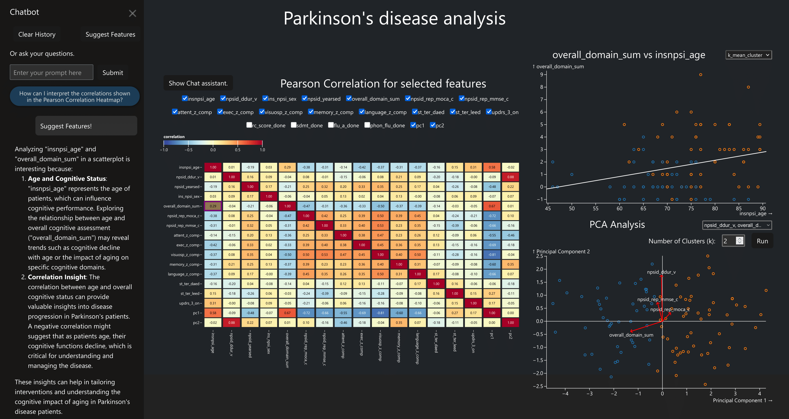

# Neurodegen-Vis

Welcome to Neurodegen-Vis - **Privacy-Preserving Visual Exploration of Healthcare Data with a Language Model Integration**

Neurodegen-Vis is a visual analytics tool designed to explore correlations and dependencies in patient data while maintaining privacy through differential privacy techniques. It integrates a Large Language Model to assist users in interpreting complex healthcare data and navigating dashboard interactions.

The work was published in the Joint Proceedings of the [ECAI 2025](https://ecai2025.org/) Workshops XAI-KRKG and UCEX-XAI. The dashboard is also available on a demo server.

[🚀 Try the Demo](https://hereditary.cgv.tugraz.at/neurodegen-vis/) | [📄 Read the Paper](https://tugraz.elsevierpure.com/en/publications/privacy-preserving-visual-exploration-of-healthcare-data-with-a-l/) | [📥 Download PDF](https://tugraz.elsevierpure.com/ws/portalfiles/portal/102330293/main.pdf)



## Key Features

- **Privacy-First Analytics:** Data is anonymized using **Differential Privacy** to protect patient confidentiality.
- **Dataset:** The example dataset includes demographic information, cognitive test results, and treatment data from Parkinson’s disease patients.
- **LLM Assistance:** An integrated chatbot acts as a co-pilot to help users understand, explore, and analyze the dashboard and the underlying data:
  - **Context Awareness:** The model is aware of the dashboard’s visualizations, interactions, feature descriptions, and correlation results.
  - **Automatically Updated Visualizations:** Interacting with the chatbot dynamically updates the UI. For example:
    - Highlighting specific heatmap cells and switching to the corresponding scatterplot when discussing correlation results.
    - Switching to the corresponding histogram view when asked about feature explanations or distributions.
  - **Exploration:** Using the _Suggest Features_ function proposes feature dependencies that could be interesting to analyze and automatically updates the scatterplot accordingly.

## Run Locally

If you want to test the dashboard, it is recommended to use the [demo server](https://hereditary.cgv.tugraz.at/neurodegen-vis/)

However, it can be also run locally by

1. Add an OPEN_API_KEY and the serverflag in the .env file
2. Change the URL base path in vite.config.ts file.
3. Create the docker build

### Detailed Description

#### 1. Add an OPEN_API_KEY and the serverflag in the .env file

You additionally have to add an Language model API in a .env file, which has to be located in the base folder. Additionally you have to define the SERVER flag as false. The .env file should look like this:

```
#.env
OPENAI_API_KEY=sk-proj-...
SERVER=false
```

#### 2. Change the URL base path in vite.config.ts file.

In the file frontend\vite.config.ts change from

```
  // Deployment on Demo Server.
  base: "/neurodegen-vis",
```

To:

```
  // to run locally via Docker, uncomment the following line:
  base: "./",
```

##### 3. Creating a docker build

After you completed the first 2 steps, run

```
docker compose up --build
```

to create the docker build.

If you found this work helpful, please cite:

```
@inproceedings{2025-neurodegen-vis,
title = "Privacy-Preserving Visual Exploration of Healthcare Data with a Language Model Integration",
author = "Michael Grabner and Peter Waldert and Benedikt Kantz and Tobias Schreck",
year = "2025",
month = oct,
day = "25",
language = "English",
booktitle = "Joint Proceedings of the ECAI 2025 Workshops XAI-KRKG and UCEX-XAI, Bologna, Italy",
note = "28th European Conference on Artificial Intelligence, ECAI 2025, ECAI ; Conference date: 25-10-2025 Through 30-10-2025",
url = "https://ecai2025.org/",
}
```

This work was funded by the [HERIDTARY project](https://hereditary-project.eu/).
